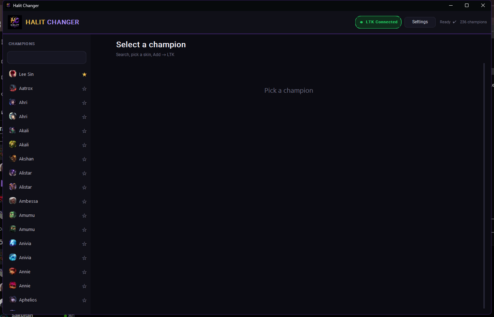
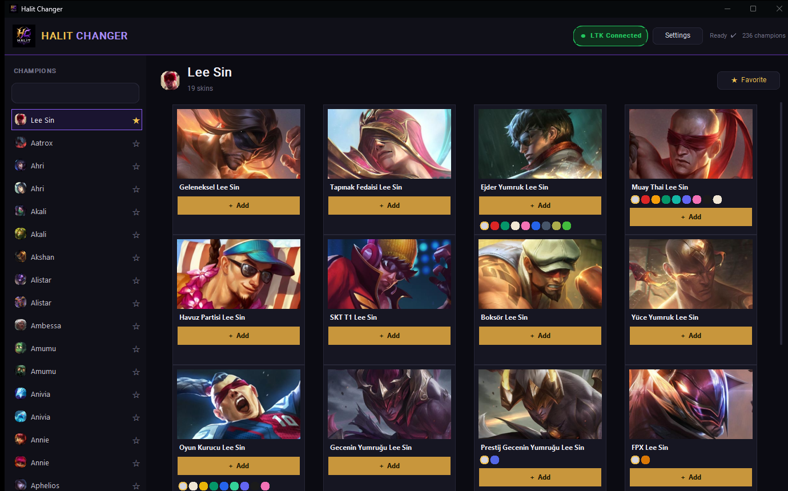

<div align="center">


# Halit Changer

**League of Legends skin tarayıcısı.** Şampiyon seç, skini seç, tek tıkla [LTK Manager](https://github.com/LeagueToolkit/ltk-manager)'a gönder.


</div>

---

Halit Changer skin dosyalarını **indirmez, açmaz, oyuna enjekte etmez**. Tek işi:
[LeagueSkins](https://github.com/Alban1911/LeagueSkins) reposundaki skin/chroma listesini taramak,
güzel bir arayüzde göstermek ve seçileni `ltk://install` protokolüyle LTK Manager'a yollamak.
İndirme, dosya kurulumu ve oyuna uygulama işinin tamamı LTK'nın sorumluluğunda — Halit Changer
sadece bir vitrin ve gönderici.

## Ekran görüntüleri

<div align="center">


</div>

## Özellikler

- 🔍 236 şampiyonun tamamı, Türkçe/İngilizce isimle anlık arama
- 🎨 Skin kartlarında chroma / color pack noktaları — varsa doğrudan seçip gönder
- ⭐ Şampiyon ve skin için favorileme
- 🔌 LTK Manager bağlantı durumu canlı gösterilir, kapalıysa uygulama kendisi başlatır
- ⚡ Görseller diskte önbelleğe alınır, ikinci açılış anında yüklenir
- 🧩 Tek dosyalık `.exe` — Python kurulumu gerekmez

## Nasıl çalışır

```
Halit Changer  →  ltk://install?url=...   →   LTK Manager   →   League of Legends
 (bul + göster)      (protokol çağrısı)      (indir + kur + uygula)
```

Skin ve chroma ID'leri repoda gelen `skin_ids.json` içinden okunur; listede olmayan bir ID
üretilmez. İlk çalıştırmada `raw.githubusercontent.com`, LTK'nın güvenilir indirme
kaynakları listesine otomatik eklenir.

## Kurulum

**Hazır uygulama (önerilen):** [Releases](../../releases) sekmesinden `Halit Changer.exe`'yi
indir, çift tıkla. Python gerekmez.

**Kaynaktan çalıştırma:**

```bash
git clone https://github.com/halitgoymen/halitchanger.git
cd halitchanger
pip install -r requirements.txt
python halit_changer.py
```

**Kendi exe'ni derlemek istersen:** `build_exe.bat` → `dist/Halit Changer.exe` üretir
(PyInstaller kullanır).

### Gereksinim

[**LTK Manager**](https://github.com/LeagueToolkit/ltk-manager/releases/latest) kurulu
olmalı. Halit Changer açıldığında LTK'yı otomatik başlatmayı dener; kurulu değilse
**Settings → LTK download page** indirme sayfasını açar. LTK'yı bir kez açıp kapatman, ayar
dosyasının oluşması için yeterli.

## Kullanım

1. Uygulamayı aç — LTK çalışmıyorsa otomatik başlatılır.
2. Soldan şampiyon ara / seç (Türkçe veya İngilizce isim ile).
3. Skin kartında chroma noktası varsa istediğini seç.
4. **Add** — skin doğrudan LTK'ya gider.
5. LTK'da skini etkinleştir ve **Run**'a bas.

Bir skin kartının görseline tıklarsan detay ve chroma listesi açılır. Favori yıldızı hem
şampiyon hem skin için ayrı ayrı kaydedilir.

## Notlar

- Halit Changer skin **taramaz/uygulamaz**; sadece bulur ve LTK'ya iletir — indirme, kurulum
  ve oyuna uygulama LTK Manager'ın işi.
- LTK bir skini "Skinhack detected" diyerek engellerse bu LTK'nın kendi güvenlik taraması;
  Halit Changer'ın bir müdahalesi yok.
- Skin değiştirme araçları sadece kozmetiktir ama yine de Riot'un kullanım koşullarına aykırı
  sayılabilir — sorumluluk kullanıcıya aittir.

## Dosyalar

| Dosya | İşlev |
|-------|-------|
| `halit_changer.py` | Uygulama kaynağı |
| `skin_ids.json` | Skin ve chroma ID'leri |
| `assets/logo.png`, `assets/icon.ico` | Logo ve pencere/exe ikonu |
| `build_exe.bat` | PyInstaller ile exe derleyici |
| `Halit Changer.spec` | PyInstaller build spec'i |
| `HalitChanger.bat` | Kaynaktan (Python ile) çalıştırıcı |

## Teşekkür

- [Alban1911/LeagueSkins](https://github.com/Alban1911/LeagueSkins) — skin kaynağı
- [LeagueToolkit/ltk-manager](https://github.com/LeagueToolkit/ltk-manager) — indirme/kurulum motoru
- [CommunityDragon](https://www.communitydragon.org/) — şampiyon/skin verisi ve görseller

## Katkı

Issue ve PR'lara açık. Yeni bir champion/skin görünmüyorsa önce
[LeagueSkins](https://github.com/Alban1911/LeagueSkins) reposunun güncel olup olmadığına bak —
skin kaynağı orası.

## Lisans

[The Unlicense](LICENSE) — public domain. Kopyala, değiştir, dağıt, sat; ne istersen yap,
izin istemene gerek yok.
