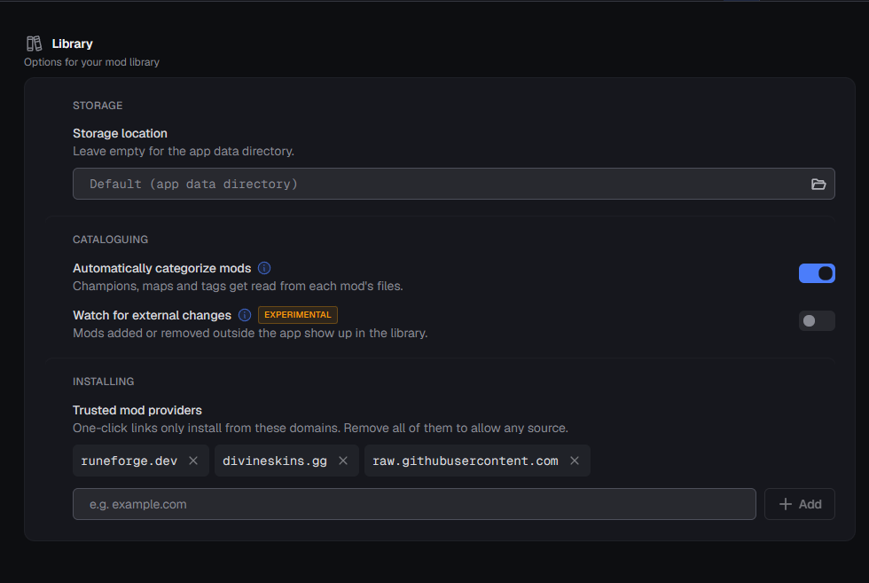
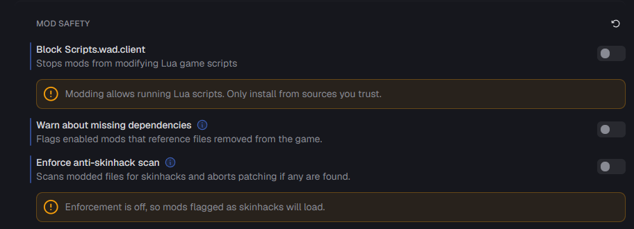

<div align="center">


# Halit Changer

**A League of Legends skin browser.** Pick a champion, pick a skin, send it to
[LTK Manager](https://github.com/LeagueToolkit/ltk-manager) in one click.


**[English](#english)** · **[Türkçe](#türkçe)**

</div>

---

## English

Halit Changer **does not download, unpack, or inject** anything into the game. All it does:
scrape the skin/chroma list from the [LeagueSkins](https://github.com/Alban1911/LeagueSkins)
repo, show it in a nice UI, and forward your pick to LTK Manager via the `ltk://install`
protocol. Downloading, installing, and applying to the game is entirely LTK's job — Halit
Changer is just a showcase and a sender.

### Screenshots

<div align="center">


</div>

### Features

- 🔍 All 236 champions, instant search by Turkish or English name
- 🎨 Chroma / color pack dots on skin cards — pick one and send directly
- ⭐ Favoriting for both champions and individual skins
- 🌐 TR / EN interface toggle in the header — remembers your choice
- 🔌 Live LTK Manager connection status; auto-starts LTK if it's not running
- ⚡ Images are cached on disk — instant load on the second launch
- 🧩 Single-file `.exe` — no Python install required

### How it works

```
Halit Changer  →  ltk://install?url=...   →   LTK Manager   →   League of Legends
 (find + show)      (protocol call)         (download + install + apply)
```

Skin and chroma IDs are read from the bundled `skin_ids.json` — no ID is ever guessed or
fabricated if it's not in that list. On first run, `raw.githubusercontent.com` is added to
LTK's trusted download sources automatically.

### Install

**Prebuilt app (recommended):** grab `Halit Changer.exe` from the
[Releases](../../releases) tab and double-click it. No Python needed.

**Run from source:**

```bash
git clone https://github.com/halitgoymen/halitchanger.git
cd halitchanger
pip install -r requirements.txt
python halit_changer.py
```

**Building your own exe:** run `build_exe.bat` → produces `dist/Halit Changer.exe`
(uses PyInstaller).

#### Requirement

[**LTK Manager**](https://github.com/LeagueToolkit/ltk-manager/releases/latest) must be
installed. Halit Changer tries to auto-start it on launch; if it's missing, **Settings → LTK
download page** opens the download page for you. Open and close LTK once so its settings file
gets created.

**Two settings inside LTK itself must be set correctly, or skins will refuse to install:**

<div align="center">


</div>

1. **Settings → Library → Trusted mod providers** must include `raw.githubusercontent.com`.
   Halit Changer adds this automatically on first run, but only takes effect after LTK is
   restarted — if one-click installs silently do nothing, check this list.
2. **Settings → Mod Safety → Enforce anti-skinhack scan** should be turned **off**.
   Community skins from LeagueSkins routinely get flagged as false-positive "skinhacks" by
   this scan and get blocked from loading — this is LTK's own gate, not something Halit
   Changer can bypass from the outside.

### Usage

1. Launch the app — LTK auto-starts if it isn't running.
2. Search / pick a champion from the sidebar (Turkish or English name works).
3. If the skin card has a chroma dot, pick the one you want.
4. **Add** — the skin goes straight to LTK.
5. Enable it in LTK and hit **Run**.

If **Add** doesn't seem to install anything in LTK, double-check the two LTK settings from
[Requirement](#requirement) above — trusted providers and the anti-skinhack scan are the
usual culprits.

Click a skin card's image to open its detail view with the full chroma list. The favorite
star is saved separately for champions and for skins.

### Notes

- Halit Changer **never installs or applies** a skin itself — it only finds it and hands it
  off to LTK Manager, which owns the download/install/apply pipeline.
- If LTK blocks a skin with "Skinhack detected", that's LTK's own security scan — Halit
  Changer has no part in it.
- Skin-changing tools are cosmetic-only, but may still violate Riot's Terms of Service —
  use at your own risk.

### Files

| File | Purpose |
|------|---------|
| `halit_changer.py` | Application source |
| `skin_ids.json` | Skin and chroma IDs |
| `assets/logo.png`, `assets/icon.ico` | Logo and window/exe icon |
| `build_exe.bat` | PyInstaller build script |
| `Halit Changer.spec` | PyInstaller build spec |
| `HalitChanger.bat` | Run-from-source launcher |

### Credits

- [Alban1911/LeagueSkins](https://github.com/Alban1911/LeagueSkins) — skin source
- [LeagueToolkit/ltk-manager](https://github.com/LeagueToolkit/ltk-manager) — download/install engine
- [CommunityDragon](https://www.communitydragon.org/) — champion/skin data and images

### Contributing

Issues and PRs welcome. If a champion or skin is missing, check whether
[LeagueSkins](https://github.com/Alban1911/LeagueSkins) has it first — that's where the skin
data comes from.

### License

[The Unlicense](LICENSE) — public domain. Copy it, modify it, sell it, do whatever — no
permission needed.

---

## Türkçe

Halit Changer skin dosyalarını **indirmez, açmaz, oyuna enjekte etmez**. Tek işi:
[LeagueSkins](https://github.com/Alban1911/LeagueSkins) reposundaki skin/chroma listesini taramak,
güzel bir arayüzde göstermek ve seçileni `ltk://install` protokolüyle LTK Manager'a yollamak.
İndirme, dosya kurulumu ve oyuna uygulama işinin tamamı LTK'nın sorumluluğunda — Halit Changer
sadece bir vitrin ve gönderici.

### Ekran görüntüleri

<div align="center">


</div>

### Özellikler

- 🔍 236 şampiyonun tamamı, Türkçe/İngilizce isimle anlık arama
- 🎨 Skin kartlarında chroma / color pack noktaları — varsa doğrudan seçip gönder
- ⭐ Şampiyon ve skin için favorileme
- 🌐 Header'da TR / EN dil seçici — seçimi hatırlar
- 🔌 LTK Manager bağlantı durumu canlı gösterilir, kapalıysa uygulama kendisi başlatır
- ⚡ Görseller diskte önbelleğe alınır, ikinci açılış anında yüklenir
- 🧩 Tek dosyalık `.exe` — Python kurulumu gerekmez

### Nasıl çalışır

```
Halit Changer  →  ltk://install?url=...   →   LTK Manager   →   League of Legends
 (bul + göster)      (protokol çağrısı)      (indir + kur + uygula)
```

Skin ve chroma ID'leri repoda gelen `skin_ids.json` içinden okunur; listede olmayan bir ID
üretilmez. İlk çalıştırmada `raw.githubusercontent.com`, LTK'nın güvenilir indirme
kaynakları listesine otomatik eklenir.

### Kurulum

**Hazır uygulama (önerilen):** [Releases](../../releases) sekmesinden `Halit Changer.exe`'yi
indir, çift tıkla. Python gerekmez.

**Kaynaktan çalıştırma:**

```bash
git clone https://github.com/halitgoymen/halitchanger.git
cd halitchanger
pip install -r requirements.txt
python halit_changer.py
```

**Kendi exe'ni derlemek istersen:** `build_exe.bat` → `dist/Halit Changer.exe` üretir
(PyInstaller kullanır).

#### Gereksinim

[**LTK Manager**](https://github.com/LeagueToolkit/ltk-manager/releases/latest) kurulu
olmalı. Halit Changer açıldığında LTK'yı otomatik başlatmayı dener; kurulu değilse
**Settings → LTK download page** indirme sayfasını açar. LTK'yı bir kez açıp kapatman, ayar
dosyasının oluşması için yeterli.

**LTK'nın kendi içinde iki ayar kesinlikle doğru olmalı, yoksa skinler kurulmayı reddeder:**

<div align="center">


</div>

1. **Settings → Library → Trusted mod providers** listesinde `raw.githubusercontent.com`
   olmalı. Halit Changer bunu ilk çalıştırmada otomatik ekler, ama etkili olması için LTK'nın
   yeniden başlatılması gerekir — tek tıkla kurulum sessizce hiçbir şey yapmıyorsa önce bu
   listeye bak.
2. **Settings → Mod Safety → Enforce anti-skinhack scan** **kapalı** olmalı. LeagueSkins'ten
   gelen topluluk skinleri bu taramada sık sık yanlış pozitif "skinhack" olarak işaretlenip
   engelleniyor — bu LTK'nın kendi kapısı, Halit Changer dışarıdan bunu aşamaz.

### Kullanım

1. Uygulamayı aç — LTK çalışmıyorsa otomatik başlatılır.
2. Soldan şampiyon ara / seç (Türkçe veya İngilizce isim ile).
3. Skin kartında chroma noktası varsa istediğini seç.
4. **Add** — skin doğrudan LTK'ya gider.
5. LTK'da skini etkinleştir ve **Run**'a bas.

Bir skin kartının görseline tıklarsan detay ve chroma listesi açılır. Favori yıldızı hem
şampiyon hem skin için ayrı ayrı kaydedilir.

**Add** bastığında LTK'da hiçbir şey kurulmuyorsa yukarıdaki [Gereksinim](#gereksinim)
bölümündeki iki LTK ayarını kontrol et — trusted providers ve anti-skinhack taraması genelde
sebep oluyor.

### Notlar

- Halit Changer skin **taramaz/uygulamaz**; sadece bulur ve LTK'ya iletir — indirme, kurulum
  ve oyuna uygulama LTK Manager'ın işi.
- LTK bir skini "Skinhack detected" diyerek engellerse bu LTK'nın kendi güvenlik taraması;
  Halit Changer'ın bir müdahalesi yok.
- Skin değiştirme araçları sadece kozmetiktir ama yine de Riot'un kullanım koşullarına aykırı
  sayılabilir — sorumluluk kullanıcıya aittir.

### Dosyalar

| Dosya | İşlev |
|-------|-------|
| `halit_changer.py` | Uygulama kaynağı |
| `skin_ids.json` | Skin ve chroma ID'leri |
| `assets/logo.png`, `assets/icon.ico` | Logo ve pencere/exe ikonu |
| `build_exe.bat` | PyInstaller ile exe derleyici |
| `Halit Changer.spec` | PyInstaller build spec'i |
| `HalitChanger.bat` | Kaynaktan (Python ile) çalıştırıcı |

### Teşekkür

- [Alban1911/LeagueSkins](https://github.com/Alban1911/LeagueSkins) — skin kaynağı
- [LeagueToolkit/ltk-manager](https://github.com/LeagueToolkit/ltk-manager) — indirme/kurulum motoru
- [CommunityDragon](https://www.communitydragon.org/) — şampiyon/skin verisi ve görseller

### Katkı

Issue ve PR'lara açık. Yeni bir champion/skin görünmüyorsa önce
[LeagueSkins](https://github.com/Alban1911/LeagueSkins) reposunun güncel olup olmadığına bak —
skin kaynağı orası.

### Lisans

[The Unlicense](LICENSE) — public domain. Kopyala, değiştir, dağıt, sat; ne istersen yap,
izin istemene gerek yok.
